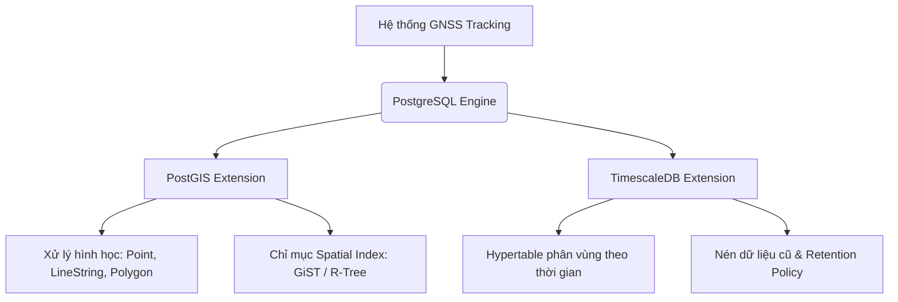

# 🎓 TÀI LIỆU HỎI ĐÁP PHẢN BIỆN (FAQ) VỀ KIẾN TRÚC CƠ SỞ DỮ LIỆU

> Tài liệu này tổng hợp các câu hỏi và câu trả lời thường gặp từ Hội đồng phản biện liên quan đến việc lựa chọn công nghệ lưu trữ dữ liệu không gian và lịch sử hành trình trong dự án GNSS Tracking System.

---

## ❓ Câu 1: Tại sao hệ thống lại sử dụng PostGIS (PostgreSQL) làm cơ sở dữ liệu chính mà không sử dụng các giải pháp NoSQL nổi tiếng như Cassandra?

### 💡 Trả lời phản biện:
Dự án lựa chọn **PostgreSQL kết hợp với tiện ích mở rộng PostGIS** thay vì NoSQL (như Cassandra) dựa trên các lý do cốt lõi sau:

1. **Hỗ trợ kiểu dữ liệu và tiêu chuẩn không gian (GIS Standards):**
   * PostGIS tuân thủ nghiêm ngặt tiêu chuẩn *Simple Features for SQL* của OGC (Open Geospatial Consortium). Nó hỗ trợ sẵn các kiểu dữ liệu không gian phức tạp như `Point` (Điểm), `LineString` (Đường đi), `Polygon` (Vùng địa lý)...
   * Cassandra không có các kiểu dữ liệu hình học này, chỉ lưu dữ liệu dạng thô (ví dụ: chuỗi hoặc số thực kinh/vĩ độ), đòi hỏi xử lý phức tạp ở tầng ứng dụng.

2. **Hệ thống hàm xử lý hình học cực kỳ mạnh mẽ:**
   * PostGIS tích hợp sẵn hàng trăm hàm tính toán tối ưu bằng C++ (như `ST_Distance`, `ST_Contains`, `ST_DWithin`, `ST_Within`). Phép tính hình học (như kiểm tra thiết bị đi vào/ra khỏi vùng Geofence) được thực hiện trực tiếp bên dưới engine DB.
   * Nếu dùng Cassandra, chúng ta sẽ phải tải toàn bộ tọa độ về tầng ứng dụng và tự cài đặt các thuật toán hình học phức tạp, gây thắt nút cổ chai (bottleneck) về cả CPU và băng thông mạng.

3. **Chỉ mục không gian chuyên dụng (Spatial Indexing):**
   * PostGIS hỗ trợ cấu trúc chỉ mục **R-Tree** (thông qua chỉ mục GiST - Generalized Search Tree). Chỉ mục này giúp truy vấn tọa độ đa chiều cực nhanh (ví dụ: tìm các thiết bị trong bán kính $R$).
   * Cassandra chỉ hỗ trợ lập chỉ mục 1 chiều dựa trên khóa phân vùng (`Partition Key`). Việc thực hiện truy vấn không gian quét theo vùng (Bounding Box) trên Cassandra là cực kỳ kém hiệu quả và phức tạp.

4. **Tính quan hệ và toàn vẹn dữ liệu (ACID & Joins):**
   * Dữ liệu bản đồ và giám sát có tính quan hệ cao (ví dụ: một Tọa độ gắn với Thiết bị, thuộc về Người dùng, di chuyển trên một Tuyến đường định sẵn). PostgreSQL hỗ trợ phép `JOIN` và ràng buộc toàn vẹn khóa ngoại giúp thiết kế cơ sở dữ liệu gọn gàng, tránh dư thừa và đảm bảo tính nhất quán tức thời.

---

## ❓ Câu 2: Trong hệ thống hiện tại có lưu lại lịch sử tọa độ di chuyển của thiết bị không? Nếu có thì được thiết kế và lưu trữ như thế nào?

### 💡 Trả lời phản biện:
**Có, hệ thống lưu trữ toàn bộ lịch sử tọa độ di chuyển của thiết bị** dưới dạng một chuỗi thời gian (time-series telemetry logs).

#### 🛠️ Thiết kế chi tiết tại mã nguồn:
* **Thực thể dữ liệu (Entity):** Được định nghĩa tại lớp [`Telemetry`](file:///root/gnss-system/src/modules/telemetry/entities/telemetry.entity.ts).
  * Bảng cơ sở dữ liệu: `telemetry`
  * Các trường lưu trữ chính:
    * `device_id` (UUID): Khóa ngoại liên kết tới thiết bị.
    * `timestamp` (Timestamp): Thời gian thiết bị ghi nhận tọa độ GPS.
    * `lat` & `lng` (Double/Float): Kinh độ và vĩ độ dạng số thực.
    * `geom` (`geometry(Point, 4326)`): Cột hình học được thiết lập chỉ mục không gian chuyên dụng.
    * `speed` & `heading`: Tốc độ và hướng di chuyển của thiết bị tại thời điểm đó.
* **Cơ chế lưu trữ và truy vấn:**
  * Được quản lý bởi lớp [`TelemetryService`](file:///root/gnss-system/src/modules/telemetry/telemetry.service.ts).
  * Hàm `savePoint` / `saveBatch`: Lưu một điểm hoặc một lô dữ liệu tọa độ mới nhận được từ MQTT/Gateway và tự động tính toán cột `geom` bằng hàm `ST_SetSRID(ST_MakePoint(lng, lat), 4326)`.
  * Hàm `findHistory`: Hỗ trợ truy vấn lịch sử hành trình của thiết bị theo khoảng thời gian (`from` - `to`), có phân trang và sắp xếp.

---

## ❓ Câu 3 (Nâng cao): Nếu số lượng thiết bị rất lớn, dữ liệu GPS đổ về liên tục, PostgreSQL có bị quá tải không? Làm sao hệ thống của em giải quyết được bài toán Big Data này?

### 💡 Trả lời phản biện (Điểm cộng kiến trúc tối ưu):
Hệ thống không sử dụng PostgreSQL thuần túy để lưu lịch sử, mà đã tích hợp **TimescaleDB** (một phần mở rộng cơ sở dữ liệu chuỗi thời gian được xây dựng trên PostgreSQL) kết hợp với **PostGIS**.

Giải pháp tối ưu hiệu năng cụ thể trong dự án bao gồm:

1. **Hypertable (Bảng phân vùng tự động):**
   * Lịch sử tọa độ (`telemetry`) được chuyển đổi thành một **Hypertable** phân vùng tự động theo thời gian (`timestamp`). Hệ thống tự tạo các phân vùng nhỏ (chunks) theo ngày/tuần, giúp tốc độ ghi dữ liệu (insert) luôn giữ ở mức ổn định cho dù bảng có lên tới hàng trăm triệu dòng.

2. **Chính sách Nén dữ liệu (Compression Policy):**
   * Hệ thống tự động kích hoạt nén dữ liệu chuỗi thời gian sau 7 ngày (`timescaledb.compress`), gom dữ liệu theo nhóm thiết bị (`device_id`). Cơ chế nén cột (columnar compression) của TimescaleDB giúp tiết kiệm đến **90% dung lượng đĩa** và tăng tốc truy vấn lịch sử cũ lên hàng chục lần.

3. **Chính sách Dọn dẹp dữ liệu (Retention Policy):**
   * Tự động xóa hoặc chuyển lưu trữ các bản ghi lịch sử thô đã quá hạn 6 tháng, đảm bảo cơ sở dữ liệu hoạt động ổn định lâu dài.

---

### 📌 Tóm tắt Công nghệ Cơ sở dữ liệu sử dụng:

---

## ❓ Câu 4: SRID 4326 trong mã nguồn có ý nghĩa gì? Tại sao lại dùng hệ tọa độ này thay vì Web Mercator (SRID 3857) thường thấy trên web?

### 💡 Trả lời phản biện:
* **Ý nghĩa của SRID 4326:**
  * Đây là mã định danh cho hệ tọa độ địa lý **WGS 84** (hệ tọa độ mô phỏng hình dáng Trái Đất dạng elipsoid). Tọa độ của nó được biểu diễn trực tiếp bằng Đơn vị độ (Latitude - Vĩ độ, Longitude - Kinh độ). Đây chính là định dạng chuẩn mà các phần cứng thu nhận tín hiệu GPS/GNSS trả về.
* **Tại sao không lưu dưới dạng SRID 3857 (Web Mercator)?**
  * SRID 3857 là hệ tọa độ phẳng dùng cho các hệ thống hiển thị bản đồ trên Web (như Leaflet, OpenStreetMap, Google Maps) để kéo dẹp hình cầu Trái Đất lên một màn hình phẳng 2D.
  * Việc lưu gốc dưới dạng **4326** giúp lưu trữ nguyên bản dữ liệu thô nhận được từ thiết bị mà không cần qua khâu chuyển đổi hệ tọa độ ở tầng Gateway (tiết kiệm CPU). Khi hiển thị lên Frontend, thư viện bản đồ sẽ tự động chiếu (project) từ 4326 sang 3857 để vẽ lên màn hình.

---

## ❓ Câu 5: Hệ thống của em phát hiện cảnh báo đi lệch tuyến (Route Deviation) hay xâm nhập vùng cấm (Geofencing) như thế nào?

### 💡 Trả lời phản biện:
Hệ thống sử dụng các phép toán không gian của PostGIS kết hợp giữa tọa độ thực tế của thiết bị (`telemetry.geom`) và vùng địa lý được định sẵn:

1. **Phát hiện Geofence (Xâm nhập/rời vùng cấm):**
   * Trong module Geofences, hệ thống sử dụng hàm **`ST_Within`** (hoặc `ST_Contains`) để kiểm tra xem điểm tọa độ của thiết bị có nằm trong đa giác Geofence (`Polygon`) hay không.
   * `ST_Within(ST_SetSRID(ST_MakePoint(lng, lat), 4326), geofence.geom)`
   * Nếu kết quả trả về `true` và trước đó trạng thái là `false`, hệ thống sẽ kích hoạt một sự kiện (event) cảnh báo đi vào vùng cấm.

2. **Phát hiện Đi lệch tuyến (Route Deviation):**
   * Được xử lý trong lớp [`RouteDeviationService`](file:///root/gnss-system/src/modules/route-plans/route-deviation.service.ts).
   * Hệ thống sử dụng hàm **`ST_Distance`** phiên bản địa lý (`geography`) để đo khoảng cách thực tế (bằng mét) từ điểm tọa độ hiện tại của thiết bị đến đường đi định sẵn của tuyến đường (`LineString` của Route Plan).
   * Nếu khoảng cách này vượt quá ngưỡng cho phép (ví dụ: > 100m), hệ thống sẽ lập tức tạo ra cảnh báo lệch tuyến.

---

## ❓ Câu 6: Tại sao trong thực thể `Telemetry` em lại dùng kiểu dữ liệu `geometry` thay vì `geography`?

### 💡 Trả lời phản biện:
Đây là quyết định cân đối giữa hiệu năng và độ chính xác:
* **Geometry (Hình học phẳng):** Tính toán cực kỳ nhanh vì sử dụng toán học phẳng Descartes 2D. Nó phù hợp với phần lớn các bài toán lưu trữ và lọc sơ bộ vùng.
* **Geography (Hình học mặt cầu):** Tính toán chậm hơn nhiều vì phải áp dụng các công thức lượng giác mặt cầu phức tạp (độ cong Trái Đất) để tính toán khoảng cách mét thực tế.
* **Giải pháp kết hợp của em:**
  * Em lưu cột gốc là `geometry(Point, 4326)` để tối ưu hóa tốc độ ghi và tìm kiếm vùng (Bounding box query qua GiST).
  * Khi cần tính khoảng cách chính xác theo đơn vị mét (như trong hàm `findNearby` hoặc tính lệch tuyến), em thực hiện **ép kiểu động** ngay trong câu lệnh SQL: `geom::geography` để tính toán chính xác trên mặt cong Trái Đất. Việc này giúp tận dụng tối đa tốc độ của Geometry khi truy vấn lọc và độ chính xác của Geography khi tính toán khoảng cách.

---

## ❓ Câu 7: Làm sao em đảm bảo tính bảo mật và riêng tư của dữ liệu vị trí người dùng?

### 💡 Trả lời phản biện:
Dữ liệu vị trí là dữ liệu nhạy cảm, vì thế hệ thống áp dụng cơ chế kiểm tra quyền truy cập ở mức ứng dụng (Application-level access control):
* Trước khi người dùng hoặc một bên thứ ba có thể truy vấn lịch sử tọa độ (`findHistory` hoặc `findLatest`), hệ thống luôn thực hiện bước kiểm tra quyền sở hữu thiết bị thông qua hàm `devicesService.findOne(deviceId, requesterId, isAdmin)`.
* Hệ thống sẽ so khớp ID người dùng yêu cầu (`requesterId`) với cột `owner_id` của thiết bị trong bảng `devices`. Chỉ có chủ sở hữu của thiết bị hoặc tài khoản Quản trị viên (`isAdmin = true`) mới được quyền lấy dữ liệu tọa độ từ bảng `telemetry`. Mọi yêu cầu trái phép đều bị từ chối bằng mã lỗi `403 Forbidden` hoặc `404 Not Found`.
