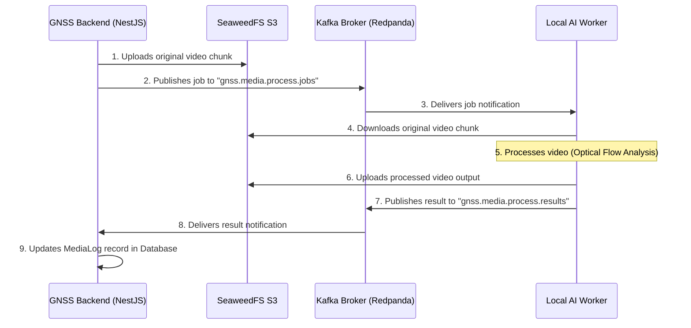

# AI Integration Plan: Optical Flow AI Processing Connection

This document defines the integration protocols, connection details, and message schemas required for the **Optical Flow AI Processing Worker** running locally to connect with the production backend server.

---

## 🗺️ 1. Architecture Flow

The video processing flow operates asynchronously using **Apache Kafka** for messaging and **SeaweedFS (S3)** for file storage.



---

## ⚙️ 2. Connection Configurations

Please configure your local AI worker environment using the credentials and hosts below:

### 📡 A. Apache Kafka (Redpanda)
Used for asynchronous task dispatch and result collection.

| Parameter | Configuration Value | Description |
| :--- | :--- | :--- |
| **Bootstrap Server** | `gnss.sang2004.io.vn:9092` | Production Kafka broker entrypoint |
| **Client ID** | `gnss-ai-worker` | Unique client identifier for connections |
| **Consumer Group ID** | `gnss.media.process.jobs.group` | Consumer group to keep track of processed offsets |
| **Job Topic (Subscribe)** | `gnss.media.process.jobs` | AI worker listens to this topic to receive new jobs |
| **Result Topic (Publish)** | `gnss.media.process.results` | AI worker sends processing status here |
| **Max Poll Interval** | `3600000` (1 giờ) | Cấu hình `max.poll.interval.ms` bắt buộc để tránh timeout khi xử lý AI lâu |

### 🪣 B. SeaweedFS (S3 Storage)
Used for storing raw videos and outputting processed results.

| Parameter | Configuration Value | Description |
| :--- | :--- | :--- |
| **S3 Endpoint** | `https://gnss.sang2004.io.vn` | S3 API base URL (uses HTTPS reverse proxy) |
| **Access Key** | `gnss_s3_admin` | S3 authentication access key |
| **Secret Key** | `s3_sec_9d8f7e6d5c4b3a2` | S3 authentication secret key |
| **S3 Region** | `us-east-1` | S3 default region configuration |
| **Bucket Name** | `medias` | S3 bucket containing all media |
| **Force Path Style** | `true` | Must be set to `true` (SeaweedFS requirement) |

---

## ✉️ 3. Message Formats

### 📥 A. Job Request Message
Sent by the NestJS Backend. The AI worker must consume messages from `gnss.media.process.jobs`.

*   **Topic**: `gnss.media.process.jobs`
*   **Key**: `<jobId>` (Same as `MediaLog` ID)
*   **Format**: JSON

**Example Payload**:
```json
{
  "jobId": "f78e2b4d-9a8b-7c6d-5e4f-3a2b1c0d9e8f",
  "deviceId": "device-uuid-12345",
  "inputS3Key": "media-logs/device-uuid-12345/1781000000000.mp4",
  "mode": "VECTORS",
  "isMoving": true
}
```

*   **`jobId`** (string): The unique ID of the media log. Use this exact ID in the response message.
*   **`deviceId`** (string): The ID of the device that uploaded the video.
*   **`inputS3Key`** (string): The S3 key location of the video file inside the S3 bucket. Download the video from S3 using this key.
*   **`mode`** (enum): `'VECTORS'` or `'HEATMAP'`. Determines the visualization style of optical flow.
*   **`isMoving`** (boolean): Indicates whether the camera is moving (affects stabilization algorithms).

---

### 📤 B. Job Response Message
Must be produced by the AI worker upon completion or failure of a job.

*   **Topic**: `gnss.media.process.results`
*   **Key**: `<jobId>`
*   **Format**: JSON

**Example Success Payload**:
```json
{
  "jobId": "f78e2b4d-9a8b-7c6d-5e4f-3a2b1c0d9e8f",
  "status": "completed",
  "outputS3Key": "media-logs/device-uuid-12345/processed-1781000000000.mp4"
}
```

**Example Failure Payload**:
```json
{
  "jobId": "f78e2b4d-9a8b-7c6d-5e4f-3a2b1c0d9e8f",
  "status": "failed",
  "error": "Failed to extract video frames: invalid codec format"
}
```

*   **`jobId`** (string): Must match the `jobId` received in the job request.
*   **`status`** (enum): `'completed'`, `'failed'`, or `'cancelled'`.
*   **`outputS3Key`** (string): The S3 key where the processed video file was uploaded. Required if status is `'completed'`.
*   **`error`** (string): Detailed error message. Required if status is `'failed'`.

---

## 🎥 4. Yêu cầu mã hóa Video (Crucial for Web Playback)

Để video sau khi AI xử lý xong có thể phát trực tiếp mượt mà trên trình duyệt Web (Frontend), **local AI worker** cần tuân thủ các quy tắc mã hóa (codec) sau:

### ⚠️ Vấn đề của OpenCV:
Nếu code Python của bạn ghi video trực tiếp bằng OpenCV qua `cv2.VideoWriter_fourcc(*'mp4v')` hoặc `*'XVID'`, video sinh ra sẽ có định dạng **MPEG-4 Part 2**. Định dạng này **không được hỗ trợ phát trực tiếp** bởi hầu hết các trình duyệt hiện đại (Chrome, Safari, Cốc Cốc) và sẽ hiển thị màn hình đen xoay vòng (loading spinner) vô hạn.

### ✅ Giải pháp:
Bạn cần chuyển đổi (transcode) video đầu ra sang chuẩn **H.264 (AVC)**, đồng thời đưa metadata (moov atom) lên đầu file (`faststart`) để hỗ trợ stream trực tiếp mà không cần đợi tải toàn bộ file 24MB.

Cách tốt nhất là sử dụng `ffmpeg` trong Python sau khi OpenCV ghi xong file video tạm thời:

```python
import subprocess

def transcode_to_h264(temp_input_path, final_output_path):
    # Sử dụng ffmpeg để convert sang H.264 chuẩn web
    subprocess.run([
        'ffmpeg', '-y',
        '-i', temp_input_path,
        '-vcodec', 'libx264',
        '-pix_fmt', 'yuv420p',       # Bắt buộc để tương thích với trình duyệt/HTML5
        '-movflags', '+faststart',   # Đưa metadata lên đầu file giúp stream mượt mà
        final_output_path
    ], check=True)
```

Sau khi chạy xong hàm transcode này, hãy upload file `final_output_path` lên SeaweedFS S3.

---

## 🛠️ 5. Verification and testing

1.  **Consume Test**: Run your local AI worker configured with the above details. Verify it establishes a successful connection to the Kafka Broker and starts polling the `gnss.media.process.jobs` topic.
2.  **S3 Test**: Verify the worker can download the object using the credentials and endpoint provided.
3.  **Produce Test**: Push a mock result message to `gnss.media.process.results` and check the server logs to confirm that the server successfully updates the `media_logs` row state to `completed` or `failed`.
