# 📱 Báo Cáo Tích Hợp App Điện Thoại với GNSS Vision Backend

> **Ngày**: 2026-05-12 | **Phiên bản Backend**: NestJS 11 + EMQX 5.8 + Redpanda (Kafka)

---

## 1. Tổng Quan Kiến Trúc Hiện Tại

```mermaid
graph LR
    subgraph Hardware
        DEV[GNSS Device / PAI]
    end

    subgraph "Message Broker"
        EMQX[EMQX 5.8<br/>MQTT Broker]
        KAFKA[Redpanda<br/>Kafka Compatible]
    end

    subgraph "NestJS Backend"
        MQTT_SVC[MqttService<br/>Bridge MQTT - Kafka]
        TELE_SVC[TelemetryService<br/>Kafka Consumer]
        DEV_SVC[DevicesService<br/>Kafka Consumer]
        ALERT_SVC[AlertsService<br/>Kafka Consumer]
        API[REST API<br/>:3001/api/*]
    end

    subgraph "Storage"
        S3[SeaweedFS<br/>Object Storage]
    end

    subgraph "Mobile App"
        MOBILE_APP[Android / iOS App]
    end

    %% Luồng Telemetry & Commands
    DEV -->|MQTT Publish| EMQX
    EMQX -->|Subscribe| MQTT_SVC
    MQTT_SVC -->|Produce| KAFKA
    KAFKA -->|Consume Batch| TELE_SVC
    KAFKA -->|Consume Batch| DEV_SVC
    KAFKA -->|Consume Batch| ALERT_SVC
    
    %% Luồng API & App
    MOBILE_APP -->|REST API Auth| API
    MOBILE_APP -->|MQTT Subscribe| EMQX

    %% Luồng Ảnh (Presigned URL)
    DEV -->|1. Xin URL / 3. Confirm| API
    API -.->|2. Cap Presigned URL| S3
    DEV -->|Upload truc tiep PUT| S3
    MOBILE_APP -->|Tai anh GET| S3
```



### Luồng dữ liệu chính:
1. **Telemetry**: Thiết bị gửi GPS/trạng thái qua MQTT topic `devices/{deviceId}/telemetry`. `MqttService` đẩy sang Kafka để các consumer xử lý song song.
2. **Commands**: Backend có thể đẩy lệnh điều khiển xuống Thiết bị qua MQTT.
3. **Ảnh (Presigned URL)**: Thiết bị xin URL từ REST API, sau đó **upload ảnh trực tiếp** lên SeaweedFS (bỏ qua Backend để không gây nghẽn băng thông), rồi báo lại cho Backend ghi nhận DB.
4. **Mobile App**: Kết nối REST API để lấy dữ liệu, subscribe MQTT để nhận update real-time (tọa độ, báo động), và tải ảnh trực tiếp từ SeaweedFS.

---

## 2. Các MQTT Topic

### 2.1 Subscribe Topics (Backend lắng nghe ← Device gửi lên)

| # | Topic Pattern | Ai Publish | Ai Subscribe | QoS | Mô tả |
|:--|:---|:---|:---|:---|:---|
| 1 | `devices/{deviceId}/telemetry` | IoT Device | Backend | 0/1 | GPS + trạng thái thiết bị định kỳ |
| 2 | `devices/{deviceId}/events` | IoT Device | Backend | 1 | Các sự kiện tức thời (SOS, va chạm, mất nguồn...) |
| 3 | `devices/{deviceId}/commands/reply`| IoT Device | Backend | 1 | Xác nhận (ACK) thiết bị đã chạy xong lệnh điều khiển |
| 4 | `devices/{deviceId}/logs` | IoT Device | Backend | 0 | Log lỗi, debug từ phần cứng để server chẩn đoán |

---

**1. Payload `telemetry` (Định kỳ 5s-10s):**
```json
{
  "location": { "lat": 10.762622, "lng": 106.660172 },
  "accuracyStatus": "fused",
  "battery_level": 85,
  "camera_status": true,
  "gnss_status": true
}
```

**2. Payload `events` (Gửi ngay lập tức khi có biến):**
```json
{
  "eventType": "sos_button_pressed",
  "timestamp": "2026-05-12T22:00:00Z",
  "severity": "critical",
  "metadata": {
     "speed_kmh": 0,
     "lat": 10.762622,
     "lng": 106.660172
  }
}
```

**3. Payload `commands/reply` (Trả lời khi server gửi lệnh):**
```json
{
  "commandId": "cmd-12345",
  "status": "success",
  "message": "Reboot scheduled in 5 seconds"
}
```


### 2.2 Publish Topics (Backend gửi đi → Device nhận)

| # | Topic Pattern | Ai Publish | Ai Subscribe | QoS | Mô tả |
|:--|:---|:---|:---|:---|:---|
| 1 | `devices/{deviceId}/commands/capture_media` | Backend | IoT Device | 1 | Yêu cầu thiết bị chụp ảnh/quay video ngay lập tức |
| 2 | `devices/{deviceId}/commands/update_config` | Backend | IoT Device | 1 | Cập nhật cấu hình (ví dụ: đổi thời gian ping GPS) |
| 3 | `devices/{deviceId}/commands/system` | Backend | IoT Device | 1 | Các lệnh hệ thống (Reboot, Reset factory) |
| 4 | `devices/{deviceId}/commands/alarm` | Backend | IoT Device | 1 | Kích hoạt còi báo động (nếu thiết bị có loa) |

---

**1. Payload `capture_media` (Yêu cầu thiết bị chụp ảnh gửi về):**
```json
{
  "commandId": "cmd-12345",
  "mediaType": "image",
  "resolution": "1080p",
  "uploadProtocol": "http"
}
```

**2. Payload `update_config` (Đổi chu kỳ gửi GPS để tiết kiệm pin):**
```json
{
  "commandId": "cmd-12346",
  "telemetryIntervalMs": 30000,
  "enableCamera": false
}
```

**3. Payload `system` (Khởi động lại):**
```json
{
  "commandId": "cmd-12347",
  "action": "reboot",
  "delaySeconds": 5
}
```


---


## 4. REST API Endpoints Cho Mobile App

**Base URL**: `http://{SERVER_IP}:3001/api`  
**Auth Docs**: `http://{SERVER_IP}:3001/api/auth/docs`  
**Swagger UI**: `http://{SERVER_IP}:3001/api/docs`

### 4.1 Authentication (Better Auth)

| Method | Endpoint | Mô tả |
|:---|:---|:---|
| POST | `/api/auth/sign-up/email` | Đăng ký bằng email |
| POST | `/api/auth/sign-in/email` | Đăng nhập bằng email |
| POST | `/api/auth/sign-in/social` | Đăng nhập Google / Apple |
| GET | `/api/auth/get-session` | Lấy session hiện tại |
| POST | `/api/auth/sign-out` | Đăng xuất |
| POST | `/api/auth/token` | Lấy JWT token (cho Bearer auth) |

**Header xác thực cho mọi API call:**
```
Authorization: Bearer <jwt_token>
```

### 4.2 Devices API

| Method | Endpoint | Role | Mô tả |
|:---|:---|:---|:---|
| GET | `/api/devices` | All | Danh sách thiết bị (phân trang, filter) |
| GET | `/api/devices/:id` | All | Chi tiết thiết bị + device_status |
| POST | `/api/devices` | Admin | Tạo thiết bị mới |
| PATCH | `/api/devices/:id` | Admin | Cập nhật thiết bị |
| DELETE | `/api/devices/:id` | Admin | Xóa thiết bị |

### 4.3 Telemetry API

| Method | Endpoint | Role | Mô tả |
|:---|:---|:---|:---|
| GET | `/api/telemetry?deviceId=...&from=...&to=...` | All | Lịch sử di chuyển |
| GET | `/api/telemetry/:deviceId/latest` | All | Vị trí mới nhất |
| POST | `/api/telemetry` | Admin | Ghi 1 điểm telemetry |
| POST | `/api/telemetry/batch` | Admin | Ghi batch telemetry |

### 4.4 Alerts API

| Method | Endpoint | Role | Mô tả |
|:---|:---|:---|:---|
| GET | `/api/alerts` | All | Danh sách cảnh báo |
| GET | `/api/alerts/:id` | All | Chi tiết cảnh báo |
| PATCH | `/api/alerts/:id/resolve` | All | Đánh dấu đã xử lý |
| POST | `/api/alerts` | Admin | Tạo cảnh báo thủ công |

### 4.5 Geofences API

| Method | Endpoint | Role | Mô tả |
|:---|:---|:---|:---|
| GET | `/api/geofences` | All | Danh sách vùng geofence |
| GET | `/api/geofences/:id` | All | Chi tiết geofence |
| POST | `/api/geofences` | Admin | Tạo vùng geofence |
| DELETE | `/api/geofences/:id` | Admin | Xóa geofence |
| POST | `/api/geofences/assign-device` | Admin | Gán device vào geofence |
| GET | `/api/geofences/:id/devices` | All | DS device trong geofence |

### 4.6 Media Logs API

| Method | Endpoint | Role | Mô tả |
|:---|:---|:---|:---|
| GET | `/api/media-logs` | All | DS media logs (video/ảnh) |
| GET | `/api/media-logs/:id` | All | Chi tiết media log |

### 4.7 Image Upload API (IoT Device Dùng)

> Áp dụng kiến trúc **Presigned URL** để giảm tải cho Backend. Thiết bị xin URL, sau đó upload thẳng lên SeaweedFS.

| Method | Endpoint / URL | Mô tả |
|:---|:---|:---|
| GET | `/api/devices/:deviceId/upload-url?filename=...` | Xin Presigned URL từ Backend (Hết hạn sau 5 phút) |
| PUT | `<uploadUrl>` | Thiết bị upload file binary trực tiếp lên SeaweedFS |
| POST | `/api/devices/:deviceId/images/confirm` | Xác nhận upload xong, lưu metadata vào Backend DB |

**Body POST `/confirm`:**
```json
{
  "fileKey": "uploads/devices/abc/1715526000-camera_1.jpg",
  "timestamp": "2026-05-12T22:00:00Z",
  "lat": 10.762622,
  "lng": 106.660172
}
```

---


## 7. MQTT Topic Mới Đề Xuất Cho Mobile App

Để app điện thoại hoạt động tốt, **nên bổ sung** các topic sau:

### 7.1 Topic Push Alert Realtime Đến App

| Topic | Hướng | Mô tả |
|:---|:---|:---|
| `users/{userId}/alerts` | Backend → App | Push alert real-time |
| `users/{userId}/notifications` | Backend → App | Thông báo chung |
| `devices/{deviceId}/status` | Backend → App | Thay đổi trạng thái device |

**Payload `users/{userId}/alerts`:**
```json
{
  "id": "alert-uuid",
  "deviceId": "device-uuid",
  "alertType": "geofence_breach",
  "message": "Device X đã rời khỏi vùng an toàn",
  "lat": 10.762622,
  "lng": 106.660172,
  "snapshotUrl": "https://s3.../snapshot.jpg",
  "timestamp": "2026-05-12T21:00:00+07:00"
}
```

**Payload `devices/{deviceId}/status`:**
```json
{
  "deviceId": "device-uuid",
  "status": "online",
  "batteryLevel": 85,
  "cameraStatus": true,
  "gnssStatus": true,
  "updatedAt": "2026-05-12T21:00:00+07:00"
}
```

### 7.2 Topic App Gửi Command (App → Backend → Device)

| Topic | Hướng | Mô tả |
|:---|:---|:---|
| `app/{userId}/commands/{deviceId}` | App → Backend | App gửi lệnh điều khiển |

**Payload:**
```json
{
  "command": "capture_image",
  "params": {}
}
```
